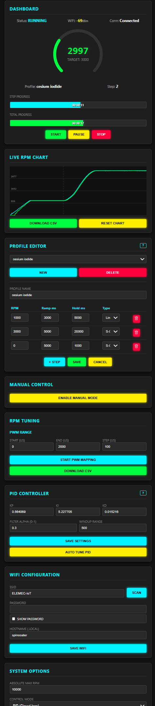

# Arduino UNO R4 WiFi Spin Coater Controller

A complete, production-quality firmware for a DIY Spin Coater based on the **Arduino UNO R4 WiFi**. This system provides a modern, responsive Web UI to control a brushless motor with precision RPM feedback, allowing for complex spin coating recipes.

## 🚀 Capabilities

*   **Web-Based Interface:** No app required. Works on mobile and desktop via a responsive Single Page Application (SPA) hosted entirely on the Arduino.
*   **WiFi Connectivity:**
    *   **Access Point Mode:** Creates a hotspot (`SpinCoater-XXXX`) for initial setup.
    *   **Station Mode:** Connects to your local WiFi network.
    *   **Captive Portal:** Easy credential configuration.
*   **Advanced Motor Control:**
    *   **Closed-Loop PID:** Maintains precise RPM regardless of load.
    *   **Auto-Tuning:** Built-in PID auto-tuner using the relay method.
    *   **Ramp Profiles:** Supports Linear, Exponential, and S-Curve acceleration profiles.
    *   **Manual Mode:** Direct slider control for testing.
*   **Profile Management:**
    *   Create, Edit, Duplicate, and Delete multi-step spin recipes.
    *   Store up to 10 profiles in non-volatile memory (EEPROM).
*   **Real-Time Telemetry:**
    *   High-speed WebSocket connection.
    *   Live Analog Gauge and RPM vs. Target Chart.
    *   Status monitoring (Current Step, Time Remaining).
*   **Safety & Maintenance:**
    *   **Stall Detection:** Stops motor if no RPM is detected while powered.
    *   **Overspeed Protection:** Emergency stop if RPM exceeds target by 15%.
    *   **Absolute Max RPM:** User-configurable hard limit.
    *   **ESC Calibration Wizard:** Guided process to synchronize ESC throttle range.

## 🛠️ Hardware Required

1.  **Microcontroller:** Arduino UNO R4 WiFi.
2.  **Motor:** Brushless DC Motor (e.g., DYS D2830 850KV).
3.  **ESC:** Electronic Speed Controller (e.g., Spektrum Avian 30A or generic BLHeli).
4.  **Sensor:** TCRT5000 Reflective IR Optical Sensor (for RPM feedback).
5.  **Power Supply:** Suitable DC supply for your motor/ESC (e.g., 12V 5A).
6.  **Marker:** White/Silver paint or reflective tape on the motor bell for the sensor.

## 🔌 Wiring

| Component | Pin Name | Arduino Pin | Notes |
| :--- | :--- | :--- | :--- |
| **ESC** | Signal (PWM) | **D9** | Servo-style PWM |
| **ESC** | Ground | **GND** | **Common Ground required** |
| **Sensor** | Digital Out | **D8** | Interrupt Pin |
| **Sensor** | VCC | **5V** | Or 3.3V depending on module |
| **Sensor** | GND | **GND** | |

> **⚠️ Important:** Ensure the Arduino and the ESC share a common ground connection, or the signal will not work.

## 📦 Installation

1.  **Dependencies:** Install the following libraries via the Arduino Library Manager:
    *   `WiFiS3`
    *   `ArduinoJson`
    *   `Arduino_LED_Matrix`
    *   `Servo Version >= 1.3.0 **⚠️ IMPORTANT**` 
2.  **Web Assets:**
    *   The HTML/JS is compressed into `web_assets.h`.
    *   To modify the UI, edit `index.html` and run: `python convert.py --mode prod index.html web_assets.h`.
3.  **Upload:** Open `SpinCoaterController.ino` in Arduino IDE and upload to the UNO R4 WiFi.

## 📖 How to Use

### 1. First Boot & WiFi Setup
*   Power on the device. The LED Matrix will display an Access Point icon.
*   Connect your phone/PC to the WiFi network **`SpinCoater-XXXX`** (password is usually empty or not set).
*   A captive portal should open. If not, navigate to `http://192.168.4.1`.
*   Enter your local WiFi credentials in the **Settings** card and click **Save WiFi**.
*   The device will reboot and connect to your network. The LED Matrix will scroll the new IP address. You can now access the controller at **`http://spincoater.local`**.

### 2. ESC Calibration (Crucial)
*   Before the first run, go to the **System Options** card on the dashboard.
*   Click **Calibrate ESC**.
*   Follow the on-screen wizard instructions carefully (requires toggling ESC power).

### 3. PWM-to-RPM Mapping (Empirical Tuning)
*   After calibrating the ESC, you must characterize your motor's performance.
*   Go to the **RPM Tuning** card.
*   Set your **Start (us)** (usually 1500), **End (us)** (usually 2000), and **Step** size.
*   Click **Start PWM Mapping**. 
*   The system will automatically ramp the motor and use **Linear Regression** to calculate a best-fit line (Slope and Intercept).
*   This step is mandatory for accurate speed control in **Open-Loop (KV)** mode and provides a baseline for PID feed-forward.

### 4. Creating a Profile
*   Go to the **Profile Editor** card.
*   Click **New**.
*   Enter a name (e.g., "Photoresist").
*   Click **+ Step** to add stages.
    *   **RPM:** Target speed.
    *   **Ramp:** Time (ms) to reach that speed.
    *   **Hold:** Time (ms) to stay at that speed.
    *   **Type:** Linear, Exponential, or S-Curve (smooth).
*   Click **Save**.

### 5. Running a Process
*   Select your profile from the dropdown in the **Dashboard** or **Profile Editor**.
*   Click **START**.
*   Monitor the live RPM gauge and chart.

### 6. PID Tuning
*   If the RPM oscillates or is slow to reach the target:
    *   Go to **PID Controller** settings.
    *   Click **Auto Tune PID**. The motor will spin up and oscillate briefly to calculate ideal P, I, and D values.
    *   Alternatively, adjust `Kp`, `Ki`, `Kd` manually.

## ⚠️ Safety Features

*   **Emergency Stop:** Click the red **STOP** button at any time to immediately cut throttle (0 RPM).
*   **Connection Loss:** If the WebSocket disconnects, the system continues the current profile but will stop if a safety fault occurs.
*   **Startup Protection:** The motor will not spin at boot until explicitly commanded.

## 🔍 Motor Health Diagnostics

The values generated during **PWM-to-RPM Mapping** provide a baseline for your hardware's health. Significant changes in these values during subsequent tunings can indicate maintenance needs:

*   **Calculated Slope (RPM/µs):** Represents motor efficiency. A **decrease** in slope over time suggests increased mechanical resistance (e.g., debris in the spindle), bearing degradation, or a weakening power supply/battery.
*   **Inferred Start PWM (µs):** Represents the "stiction" point.
    *   **Increasing values:** Indicate that the motor requires more power to overcome static friction, often a sign of old grease or tight bearings.
    *   **Values significantly far from 1500µs:** Suggest the ESC's internal neutral point has drifted and a fresh **ESC Calibration** is recommended.

## 🤖 AI-Assisted Development

This project was developed with the assistance of **Google Gemini**. The prompt.txt file contains the master prompt that defined the initial architecture and requirements, as well as the sequence of refinement prompts used to add features, debug code, and build the UI.

This repository serves as a case study in using advanced generative AI for complex, production-quality embedded systems development.

You can use this file as a template or reference for generating your own complex embedded systems with AI assistance.

---

*This project was co-created with Google Gemini.*